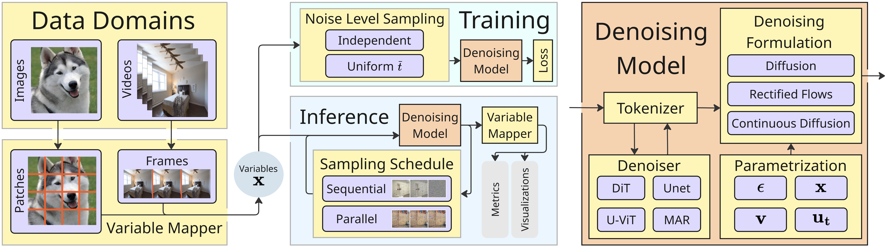

# Quick Tour

This quick tour will get you up and running with Spatial Reasoners in just a few minutes.

## Basic Usage with Predefined Experiments

To get started, you can use the `sr.run_training` function to run a predefined experiment. You can also use the `@sr.config_main` decorator to create a custom training script. For both you'll need to provide the dataset root and the experiment name. You can find datasets for the `sudoku`, `counting stars` and `counting polygons` in the `SRM` repo.

You can always start with `even_pixels` experiment, as this doesn't require any data (the images are generated on the fly).

### Basic Usage with predefined experiments

```python
import spatialreasoners as sr

# 🚀 One-line training with sensible defaults
sr.run_training() # This will run the `even_pixels` experiment


# 📂 You can also override the experiment and dataset root to use a different dataset
sr.run_training(overrides=[
    "dataset.root=/path/to/your/data", # You can take the dataset from the SRM repo
    "experiment=mnist_sudoku",
])

# 🔍 With enhanced type checking for better error messages
sr.run_training(overrides=[
    "dataset.root=/path/to/your/data", # You can take the dataset from the SRM repo
    "experiment=mnist_sudoku",
], enable_beartype=True)

# ⚙️ Customize training parameters
sr.run_training(overrides=[
    "dataset.root=/path/to/your/data", # You can take the dataset from the SRM repo
    "experiment=mnist_sudoku",    # Use specific experiment
    "trainer.max_epochs=50",      # Train for 50 epochs
    "data_loader.train.batch_size=32"  # Adjust batch size
    "denoising_model.denoiser=dit_l_2",  # Use large DiT model
])

# 🔧 More detailed customization
sr.run_training(overrides=[
    "dataset.root=/path/to/your/data", # You can take the dataset from the SRM repo
    "experiment=mnist_sudoku",


    "denoising_model/flow=cosine",       # Use cosine flow
    "denoising_model.flow.variance='learned_range'", # Customize the predicted variance
    "denoising_model/denoiser=unet_256",

    # Reset the default tokenizer and set the unet tokenizer
    "denoising_model.tokenizer=null",
    "+denoising_model.tokenizer.name=unet",
    "+denoising_model.tokenizer.concat_mask=true",

    # Set the variable mapper to image
    "variable_mapper=image",             
    "variable_mapper.variable_patch_size=28",

    # Set the batch size
    "data_loader.train.batch_size=2",  # Adjust batch size
    "data_loader.val.batch_size=2",  # Adjust batch size
    "data_loader.test.batch_size=2",  # Adjust batch size
])
```

To see which parameters can you override, check the `config` directory. Nevertheless, if you want to run more advanced experiments, we recommend you to use the `@sr.config_main` decorator with custom yaml configs.


## Custom Projects

Spatial Reasoners provides two clean approaches for creating custom research projects.

### Method 1: @sr.config_main Decorator (Recommended)

The cleanest interface for most use cases - similar to `@hydra.main` in [Hydra](https://hydra.cc/docs/intro/) but with automatic config merging.

Create your training script (`training.py`):

```python
#!/usr/bin/env python3
import spatialreasoners as sr

# Import your custom components to auto-register them
import src  # This imports and registers all your custom components

@sr.config_main(config_path="configs", config_name="main")
def main(cfg):
    """Main training function with full control over the process."""
    
    # Create components from the loaded config
    lightning_module = sr.create_lightning_module(cfg)
    data_module = sr.create_data_module(cfg)
    trainer = sr.create_trainer(cfg)
    
    # Full control - add custom callbacks, modify trainer, etc.
    trainer.fit(lightning_module, datamodule=data_module)

if __name__ == "__main__":
    main()
```

**CLI Usage:**

```bash
# Basic training with your experiment
python training.py experiment=my_experiment

# Customize any parameter via CLI
python training.py experiment=my_experiment trainer.max_epochs=100

# Multiple overrides
python training.py experiment=my_experiment trainer.max_epochs=50 dataset.subset_size=15000

# Enhanced type checking
python training.py experiment=my_experiment --enable-beartype
```

### Method 2: Inline Overrides

To run one of the built‑in experiments, call `sr.run_training()` and pass in two overrides: the dataset root and the experiment name. Example datasets for the `sudoku`, `counting stars`, and `counting polygons` tasks live in the `SRM` repository. If you’d like to get started without providing any data yourself, use the `even_pixels` experiment—it generates its own images on the fly.


```python
import spatialreasoners as sr

# 🚀 One-line training with sensible defaults
sr.run_training() # This will run the `even_pixels` experiment


# 📂 You can also override the experiment and dataset root to use a different dataset
sr.run_training(overrides=[
    "dataset.root=/path/to/your/data", # You can take the dataset from the SRM repo
    "experiment=mnist_sudoku",
])

# 🔍 With enhanced type checking for better error messages
sr.run_training(overrides=[
    "dataset.root=/path/to/your/data", # You can take the dataset from the SRM repo
    "experiment=mnist_sudoku",
], enable_beartype=True)

# ⚙️ Customize training parameters
sr.run_training(overrides=[
    "dataset.root=/path/to/your/data", # You can take the dataset from the SRM repo
    "experiment=mnist_sudoku",    # Use specific experiment
    "trainer.max_epochs=50",      # Train for 50 epochs
    "data_loader.train.batch_size=32"  # Adjust batch size
    "denoising_model.denoiser=dit_l_2",  # Use large DiT model
])

# 🔧 More detailed customization
sr.run_training(overrides=[
    "dataset.root=/path/to/your/data", # You can take the dataset from the SRM repo
    "experiment=mnist_sudoku",


    "denoising_model/flow=cosine",       # Use cosine flow
    "denoising_model.flow.variance='learned_range'", # Customize the predicted variance
    "denoising_model/denoiser=unet_256",

    # Reset the default tokenizer and set the unet tokenizer
    "denoising_model.tokenizer=null",
    "+denoising_model.tokenizer.name=unet",
    "+denoising_model.tokenizer.concat_mask=true",

    # Set the variable mapper to image
    "variable_mapper=image",             
    "variable_mapper.variable_patch_size=28",

    # Set the batch size
    "data_loader.train.batch_size=2",  # Adjust batch size
    "data_loader.val.batch_size=2",  # Adjust batch size
    "data_loader.test.batch_size=2",  # Adjust batch size
])
```

To see which parameters can you override, check the [config directory](https://github.com/spatialreasoners/spatialreasoners/tree/main/config). Nevertheless, if you want to run more advanced experiments, we recommend you to use the `@sr.config_main` decorator with custom yaml configs.


## Data Transformation Flow

<p align="center">
  
</p>

Due to the datatype-agnostic nature of 🌀Spatial Reasoners the training and inference part of Spatial Reasoners don't operate directly on the data shapes and types provided in the datasets. Datasets in our framework always return an `UnstructuredExample`. This then is batched via a Dataloader into `BatchUnstructuredExample` -- which has the same structure, only the components contain the extra batch dimension. 

Next, a `VariableMapper` is used to map the `BatchUnstructuredExample` into the strcutred `BatchVariables` that store the data samples in a standard shape of `(batch_size, num_variables, num_features)` with some other values (see below). This format is used when calculating the flow, losses and during inference.

The `Denoisers` might require the input data to have some other format -- eg. a `DiT` denoiser requires the input data to be a set of tokens. Depending on the dataset, it might be the case that the Variables and Tokens might not be the same thing (eg. in Video generation where you want Variables to correspond to frames, but you want many more tokens to represent a frame). That's why we need a `Tokenizer` -- a class that the data in the Variables format, and transforms that to model inputs. After passing the data through the `Denoiser`, `Tokenizer` also defines how they should be mapped back to the common format. 

All of this allows you to only define a couple of transformation functions and you'll be ready to start training your own `DiT` (or other model) in any domain!

Soon you can expect the detailed Components documentation, but before it arrives, you can dive into our Spiral project and check the parent classes and ther pararmeters for reference.

## Example Project: Spiral Dataset

The included example project demonstrates a complete working implementation:

### Project Structure

```
your_project/
├── training.py              # Your main training script
├── src/                     # Custom components
│   ├── __init__.py         # Auto-register components
│   ├── dataset.py          # Custom datasets
│   ├── denoiser.py         # Custom models  
│   ├── variable_mapper.py  # Custom variable mappers
│   └── tokenizer.py        # Custom tokenizers
└── configs/                # Configuration files
    ├── main.yaml           # Main config (references experiments)
    ├── experiment/         # Experiment-specific configs
    │   └── my_experiment.yaml
    ├── dataset/            # Custom dataset configs
    └── variable_mapper/    # Custom mapper configs
```

### Running the Example

```bash
cd example_project

# Method 1: @sr.config_main decorator (recommended)
python training_decorator.py experiment=spiral_training

# Method 2: Programmatic configuration  
python training_programmatic.py
```

The spiral example shows a model learning to generate points along a spiral pattern, demonstrating:

- Custom dataset, variable mapper, tokenizer, and denoiser implementations
- Clean configuration management with experiment-specific configs
- Visualization and evaluation during training

## Configuration System

Spatial Reasoners uses Hydra for flexible configuration management:

### Basic Configuration

```yaml
# configs/main.yaml
defaults:
  - experiment: null  # Users should specify experiment, or API will default to mnist_sudoku
  - time_sampler: mean_beta 
  - optimizer: default
  
validation_benchmarks: {} # override in experiment
test_benchmarks: {} # overrride in experiment

loss:
  mu:
    name: mse
    
train:
  step_offset: 0

hydra:
  run:
    dir: ""   # override!

wandb:
  project: sr #srm
  entity: sr #bartekpog-max-planck-institute-for-informatics
  mode: offline
  activated: false

data_loader:
  # Avoid having to spin up new processes to print out visualizations.
  train:
    num_workers: 16
    persistent_workers: true
    batch_size: 4096
  test:
    num_workers: 4
    persistent_workers: false
    batch_size: 4096
  val:
    num_workers: 16
    persistent_workers: true
    batch_size: 4096

seed: null

trainer:
  max_epochs: -1
  max_steps: 40001
  val_check_interval: 10000
  log_every_n_steps: 5000
  task_steps: null
  accumulate_grad_batches: 1
  precision: bf16-mixed
  num_nodes: 1
  validate: true
  profile: false
  detect_anomaly: false

torch:
  float32_matmul_precision: high  # (null --> default) highest / high / medium
  cudnn_benchmark: false

```

### Experiment Configuration

```yaml
# configs/experiment/my_experiment.yaml
# @package _global_
defaults:
  - /dataset: my_custom_dataset  # Your custom dataset

# Mix local and embedded components
variable_mapper:
  name: my_custom_mapper

denoising_model:
  learn_uncertainty: false
  flow: rectified  # From embedded configs
  denoiser:
    name: my_custom_model
  tokeniezer: 
    name: my_custom_tokenizer
```

## Creating Custom Components

Define custom components and auto-register them:

```python
# src/dataset.py
from spatialreasoners.dataset import register_dataset, DatasetCfg

from spatialreasoners.type_extensions import UnstructuredExample

@dataclass
class MyDatasetCfg(DatasetCfg):
    data_path: str = "data/"
    # Other parameters

@register_dataset("my_dataset", MyDatasetCfg)
class MyDataset(sr.Dataset):
    def __init__(self, cfg: MyDatasetCfg):
        super().__init__()
        
    @property
    def _num_available(self) -> int
        pass # get full size of the full dataset

    def __getitem__(self, idx: int) -> UnstructuredExample:
        pass # prepare Unstructured Example
```

Don't forget to import all the components from your `src` -- for the components to be properly registered and accessible during inference, the scripts with implementations need to be imported (even if you don't reference them directly in your training script).
```python
from src import *
from . import dataset
from . import denoiser
from . import variable_mapper
from . import tokenizer
```

## Next Steps

- **Explore the [API Reference](../api.md)** for detailed documentation (still in progress)
- **Check the example project** for a complete implementation and reference for your projects

## Quick Comparison: Configuration Methods

| Method | Interface | CLI Support | Setup | Best For |
|--------|-----------|-------------|-------|----------|
| `@sr.config_main` | Decorator | ✅ Automatic | Minimal | General use, research, experimentation |
| Programmatic | Function | ❌ None | Minimal | Automation, notebooks, production |

**Recommendation:** Start with Method 1 (`@sr.config_main`) for most use cases. Use Method 2 for automation or when generating configurations dynamically. 