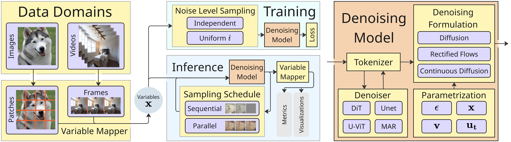

# 🌀Spatial Reasoners

**A Python package for spatial reasoning over continuous variables with generative denoising models.**

[](LICENSE)
[]()
[](https://pypi.org/project/spatialreasoners/)

<video src="assets/sampling-video.mp4" controls></video>

Try it out with 

```bash
pip install spatialreasoners
```

And check our [example project](https://github.com/spatialreasoners/spatialreasoners/tree/mainexample_project) to see how to use it.


## Overview

<p align="center">
  
</p>

🌀Spatial Reasoners is a Python package for spatial reasoning over continuous variables with generative denoising models. Denoising generative models have become the de-facto standard for image generation, due to their effectiveness in sampling from complex, high-dimensional distributions. Recently, they have started being explored in the context of reasoning over multiple continuous variables.

Our package provides a comprehensive framework to facilitate research in this area, offering easy-to-use interfaces to control:

*   **Variable Mapping:** Seamlessly map to variables from arbitrary data domains.
*   **Generative Model Paradigms:** Flexibly work with a wide range of denoising formulations.
*   **Samplers & Inference Strategies:** Implement and experiment with diverse samplers and inference techniques.

🌀Spatial Reasoners is a generalization of [Spatial Reasoning Models (SRMs)](https://geometric-rl.mpi-inf.mpg.de/srm/) to new domains, packaged as a reusable library for the research community.

## Key Features

- **🚀 One-line Training**: Get started with minimal setup using sensible defaults
- **🔧 Flexible Configuration**: Powerful config system with automatic merging of local and embedded configurations
- **📦 Modular Architecture**: Extensible design with pluggable components for datasets, models, and training strategies
- **🔬 Research-Ready**: Built-in benchmarks, evaluation protocols, and example projects
- **⚡ Production-Ready**: Lightning-based training infrastructure with distributed training support

## Architecture Overview

Spatial Reasoners is built with modularity and extensibility in mind:

```
spatialreasoners/
├── api/                  # High-level API
├── dataset/              # Data loading and processing
├── denoising_model/      # Model implementations
│   ├── denoiser/         # Denoiser architectures (UNet, DiT, MAR, etc.)
│   ├── flow/             # Flow variants (rectified, cosine, etc.)
│   └── tokenizer/        # Tokenizers of variables for the denoiser
├── training/             # Training infrastructure
├── variable_mapper/      # Variable mapping logic
├── benchmark/            # Evaluation framework
└── configs/              # Embedded default configs
```

## Research Applications

Spatial Reasoners are a generalization of the idea of diffusion models that allows using different noise levels within a sample. Before SRMs this approach has been explored by for example MAR, xAR, Rolling Diffusion and Diffusion Forcing -- Spatial Reasoners allows you to build similiar setups. For some architectures (such as Unet, DiT, xAR's variant of DiT or History Guided Diffusion's U-ViT-pose) you can just specify the denoiser config and directly start training. 

In some domains starting your work could be even faster due to already implemented Variable Mappers and some evaluations -- this is true for tasks like:

- **Sudoku generation** Our MNIST Sudoku dataset
- **Image generation** With prepared dataset implementations for ImageNet, CIFAR10, CelebA, SRM's Counting Stars and many others
- **Video generation** Where a variable is a single frame -- as in [Diffusion Forcing](https://www.boyuan.space/diffusion-forcing/)

We also highly encourage you to take Spatial Reasoners to completely new domains -- see our [example project](https://github.com/spatialreasoners/spatialreasoners/tree/main/example_project) to see how to train new models in your domain!


## Next Steps

- [Get started with installation](getting-started/installation.md)
- [Follow the quick tour](getting-started/quick-tour.md)
- [Explore the API reference](api.md)
- In depth module reference (Coming Soon!)

## Citation

If you use Spatial Reasoners in your research, please cite:

```bibtex
@inproceedings{pogodzinski25spatialreasoners,
  title={Spatial Reasoners for Continuous Variables in Any Domain},
  author={Bart Pogodzinski and Christopher Wewer and Bernt Schiele and Jan Eric Lenssen},
  booktitle={Championing Open-source DEvelopment in ML Workshop @ ICML25},
  year={2025},
  url={https://openreview.net/forum?id=89GglVwjuK}
}

@inproceedings{wewer25srm,
    title     = {Spatial Reasoning with Denoising Models},
    author    = {Wewer, Christopher and Pogodzinski, Bartlomiej and Schiele, Bernt and Lenssen, Jan Eric},
    booktitle = {International Conference on Machine Learning ({ICML})},
    year      = {2025},
}
```

## Support & Community

- **Issues**: [GitHub Issues](https://github.com/spatialreasoners/spatialreasoners/issues)
- **Email**: bpogodzi@mpi-inf.mpg.de 