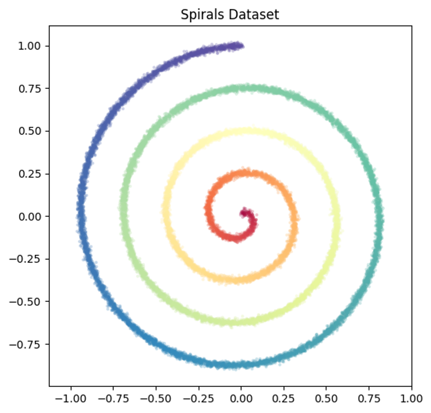

# Spiral Dataset

This directory contains demo scripts showing two different ways to run spiral training with 🌀Spatial Reasoners.

The data distribution the model tries to approximate is a spiral of points. Each datapoint is a 3D vector with x, y coordinates and a color. The color corresponds to the radius of the point.

The distribution looks like this:



During inference the points are sampled from a normal distribution with mean 0 and standard deviation 1. The model then iteratively pushes the point towards the spiral. You can see the model's progress in the following animation:


# Training

This project highlights how you can use 🌀Spatial Reasoners to train a model for your arbitrary data distribution.

## Method 1: @sr.config_main Decorator (Recommended)

**File**: `training_decorator.py`

Uses 🌀Spatial Reasoners' custom `@sr.config_main` decorator that provides the cleanest interface similar to `@hydra.main` but with proper config merging. This is the **recommended approach** for most users.

### Usage:

```bash
# Basic training with spiral_training experiment
python training_decorator.py experiment=spiral_training

# Customize training parameters via CLI
python training_decorator.py experiment=spiral_training trainer.max_epochs=100

# Change dataset size
python training_decorator.py experiment=spiral_training dataset.subset_size=20000

# Multiple overrides
python training_decorator.py experiment=spiral_training trainer.max_epochs=50 dataset.subset_size=15000

# Enable enhanced type checking
python training_decorator.py experiment=spiral_training --enable-beartype

# Get help and see examples
python training_decorator.py --help
```

### Advantages:
- ✅ **Cleanest interface** - just like `@hydra.main` 
- ✅ **Automatic config merging** (local + embedded 🌀Spatial Reasoners configs)
- ✅ **No boilerplate code** - just import, decorate, and run
- ✅ **Enhanced help system** with common overrides and examples
- ✅ **Full control** - inspect and modify config before training (e.g. dynamically modify the number of training steps)
- ✅ **Beartype integration** via `--enable-beartype` flag to enforce type safety

### When to Use:
- **Most use cases** - this is the recommended approach for training SRMs
- Interactive development and experimentation  
- When you want CLI similiar to Hydra
- Research projects with varying hyperparameters

## Method 2: Programmatic Configuration

**File**: `training_programmatic.py`

Uses `sr.run_training()` with hardcoded overrides. This approach is useful when you want to configure training programmatically within your code.

### Usage:

```bash
# Run with fixed configuration
python training_programmatic.py
```

### Advantages:
- ✅ **Programmatic control** - generate configs dynamically
- ✅ **Easy integration** into larger Python programs
- ✅ **Configuration in code** - explicit and version-controlled
- ✅ **Good for automation** - scripts, pipelines, notebooks
- ✅ **No CLI complexity** - simple function calls
- ✅ Same config merging benefits as decorator method

### When to Use:
- Automated scripts and pipelines
- Jupyter notebooks and interactive development
- When configuration logic is complex or computed
- When integrating into existing Python applications
- Production systems with fixed configurations

## Quick Comparison

| Method | Interface | CLI Support | Setup | Best For |
|--------|-----------|-------------|-------|----------|
| `@sr.config_main` | Decorator | ✅ Automatic | Minimal | General use, research, experimentation |
| Programmatic | Function | ❌ None | Minimal | Automation, notebooks, production |

## Configuration Files

Both methods use the same configuration files in the `configs/` directory:
- `main_spiral.yaml` - Main configuration file
- `experiment/spiral_training.yaml` - Spiral training experiment configuration

These local configs can reference components from 🌀Spatial Reasoners' embedded configs (e.g., `dataset: cifar10`, `denoising_model.flow: rectified`) while also defining custom components like the spiral dataset.

## Requirements

Make sure you have imported the spiral classes by including:
```python
import src  # This imports and registers all spiral components
```

This registers the spiral dataset and other components with 🌀Spatial Reasoners. The spiral components are now organized in separate modules within the `src/` directory:
- `src/dataset.py` - SpiralDataset and related functions
- `src/variable_mapper.py` - SpiralVariablMapper for data transformation
- `src/tokenizer.py` - SpiralTokenizer for model input/output handling
- `src/denoiser.py` - SpiralDenoiser MLP implementation
- `src/evaluation.py` - SpiralSamplingEvaluation for visualization during inference

## Config Merging Details

🌀Spatial Reasoners automatically merges your local configs with its embedded configurations:
- **Local configs take precedence** - your custom components override built-in ones
- **Built-in components remain accessible** - you can still use `dataset=cifar10`, `denoising_model.flow=rectified`, etc.
- **Seamless composition** - mix and match local and embedded components freely

This allows you to extend 🌀Spatial Reasoners with custom components while still leveraging the full ecosystem of built-in datasets, models, and experiments.

## Recommendation

**Start with Method 1 (`@sr.config_main`)** for most use cases. It provides the cleanest developer experience with automatic CLI support and proper config merging. Use Method 2 (Programmatic) for automation, notebooks, or when you need to generate configurations dynamically. 